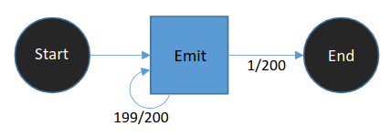

# meta_markov_model
A modular Python solution to a sequence modeling problem involving time series data from the nanopore sequencer

## Background

This project came at a time when I was working on origins of life research, which required that I could identify small 
quantities of abiotically synthesized DNA polymers with early versions of the ONT sequencer and basecaller, before 
CNN-RNN basecallers were widely used. The way signal preprocessing worked at the time was counterproductive to our goal 
of identifying very short polyA/T sequences, since they would often get filtered out. So I designed a custom method to 
find our polymers in the raw signal data, based on Hidden Markov Models.

This figure shows how one of our polymers was sequenced and segmented. The uniform region in the center represents a
homopolymeric stretch of Thymidine. The challenge is to model the entire sequence construct that was used for 
preparing the library and running it through the nanopore device.

For a brief period before the litigation started, ONT used hairpin adapters to read the same sequence in forward and 
reverse orientation. We applied this style of library prep to our abiotic polymers.

## Sequence Modeling

The challenge with this sequencing method is that we need to separate out the library construct from the abiotic 
polymers. A Hidden Markov Model (HMM) is a natural choice. The nanopore sequencer reads a current in picoamps (pA) for each
a given number of nucleotides. Depending on the chemistry, this is k~=6 or k~=10. For this project we use k=6. Every 
state in this Markov model has emissions that are distributed with a mean and variance corresponding to 
a set of known picoamp values for that k-mer.

An additional challenge with this data is that the translocation process is stochastic. Since the current recorded in 
the Nanopore is dependent on the movement of a single molecule, much of the HMM’s configuration is dedicated to 
modeling the random rate and direction of molecular movement. Segmentation handles the finer noise, but larger scale 
changes in the net motion of the DNA often result in insertions. The configuration of the model can be justified as 
follows:

- Silent **skip** states are included to take into account the possibility that the translocation will
move too quickly for detection.
- **Drop** states model real events in which the pore is temporarily (or permanently) blocked,
producing an emission of little to no current.
- The **blip** state handles noise that did not get averaged out during segmentation. Over-
segmentation was preferred over incomplete segmentation, and thus needed to be accounted
for with blip states.
- Self-transitions in **emit** states also accommodate for over-segmentation, but have the
alternate purpose of representing stalls which halt the progress of DNA’s translocation
(especially prevalent at the hairpin).
- **Emit** states are allowed reverse transitions in the event that the DNA molecule randomly shifts
backwards
- Reverse transitions were not allowed between junctions where one linear HMM branched into
another. Logically, if the current state is within a bridge, this is only possible if the next meta-
state is necessarily the other side of the bridge, otherwise the bridge state is impossible.
- Initial transitions between meta-states like the homopolymer and barcode were determined
empirically.

## A modular modeling framework

In practice, what we aim for is to be able to model any higher order sequence profile, and abstract away the details of
the base-by-base signal processing. So this project creates a meta-HMM layer of abstraction on top of the aforementioned
base-level modeling. We also could not guarantee that the ligation of the DNA fragments would proceed as planned, so I
designed the model to be agnostic to the order and quantity of sequence fragments:

This introduces some additional challenges, because the process of bridging linear models together creates new k-mers:

However, it is achievable with some careful bookkeeping during construction. With sufficient support for bridging, we
can also branch:

With these methods defined, we can now represent any relationship between subsequences, simply by defining the higher 
order graph and the expected sequence of each node:

## Results

Given the higher order model, and some signal data from our first attempt to sequence abiotic polymers on the Nanopore 
device, we can now see whether we have succeeded at observing polyT/A:

With only 14 manually curated training reads and 7 test reads, we can already get some reasonable results. We can also 
do some basic sanity tests to see how the model distinguishes between sequences from the positive test set and others, 
by comparing the log likelihood between this model and a null model:

